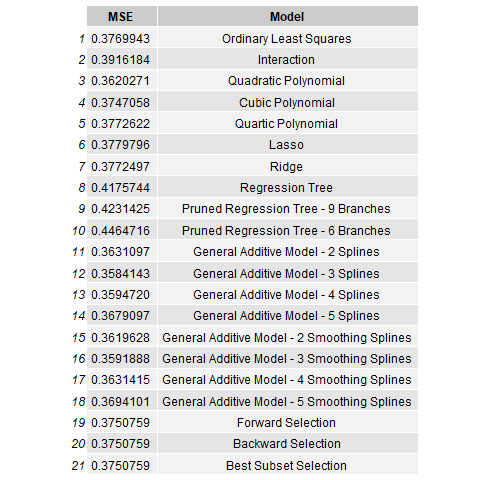
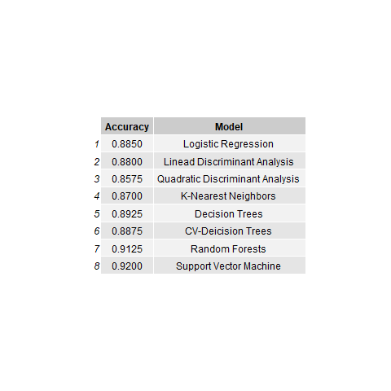

# Red-Wine-Quality-Analysis

## Purpose
This project is analyzing the quality of red wine using different machine learning methods in R.  This project examines both regression and classifcation methods to determine which model is best for the data. For classification, the wine quality is split into two groups, low and high. Low is when the wine quality rating is less than 7 and high is greater than or equal to 7. 

## Dependencies
* readr
* janitor
* corrplot
* glmnet
* tree
* splines
* gam
* leaps
* MASS
* randomForest
* class
* e1071

## Dataset Description

The data is from the UCI Machine Learning Repository, https://archive.ics.uci.edu/ml/datasets/Wine+Quality.

## Machine Learning Methods

The regression methods used are of the following:
* Ordinary Least Squares
* Subset Selection
  * Forward Selection
  * Backward Selection
  * Best Subset Selection
* Interactions
* Ridge Regression
* Lasso Regression
* Polynomial Regression
  * Quadratic
  * Cubic
  * Quartic
* Generalize Additive Models
  * 2, 3, 4, and 5 splines
  * 2, 3, 4, and 5 smoothing splines
* Regression Trees
  * Regular tree
  * Pruned tree

The classifcation methods used are of the following:
* Logistic Regression
* Linear Discriminant Analysis
* Quadratic Discriminant Analysis
* K-Nearest Neighbors
* Decision Trees
  * Regular tree
  * Cross-validated tree
* Random Forests
* Support Vector Machines

## Results

### Regression
The regression models looked at the Mean-Squared Error to test the perofmance of the models. The following table shows the test MSE for each of the models that were considered:

### Classification
The classification models looked at accuracy to test the performance of the models. The following tables has the accuracy of each of the models that were condiered:

